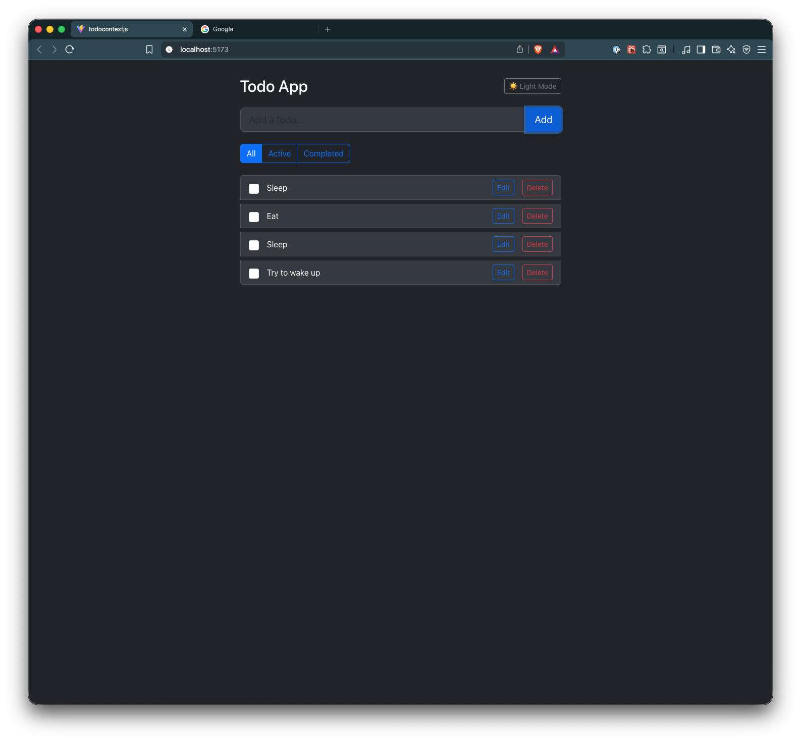
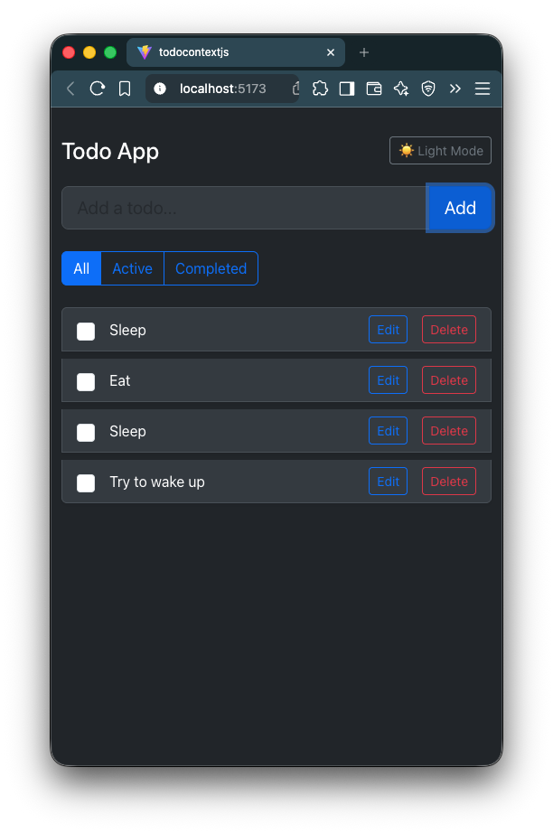

# 📋 Todo Context App

A fully functional **Todo application** built with **React and Context API**, featuring **add/edit/delete todos, filtering, light/dark theme switching, and localStorage persistence**. Perfect for practicing `useState`, `useEffect`, and `useContext` in a real-world app.

---

## 🌟 Features

* **Add Todo** – Add new tasks to your list
* **Edit Todo** – Modify the text of existing tasks
* **Delete Todo** – Remove tasks you no longer need
* **Toggle Complete** – Mark tasks as completed or active
* **Filter Todos** – View All, Active, or Completed tasks
* **Theme Switching** – Toggle between Light and Dark mode
* **Persistent Data** – Todos and theme persist across page reloads via `localStorage`

---

## 📂 Project Structure

```
TodoContext/
.
├── README.md
├── eslint.config.js
├── index.html
├── package-lock.json
├── package.json
├── public
│   └── vite.svg
├── src
│   ├── App.css
│   ├── App.jsx
│   ├── assets
│   │   └── react.svg
│   ├── components
│   │   ├── FilterButtons.jsx
│   │   ├── ThemeToggleButton.jsx
│   │   ├── TodoInput.jsx
│   │   ├── TodoItem.jsx
│   │   └── TodoList.jsx
│   ├── contexts
│   │   ├── FilterContext.jsx
│   │   ├── ThemeContext.jsx
│   │   └── TodoContext.jsx
│   ├── index.css
│   ├── main.jsx
│   └── providers
│       └── AppProviders.jsx
└── vite.config.js

7 directories, 21 files
```

---

## ⚡ How to Use

### Installation

1. Clone the repository:

```bash
git clone <https://github.com/structbase/TodoContext>
cd <TodoContext>
````

2. Install dependencies:

```bash
npm install
```

### Running the Application

1. Start the development server:

```bash
npm run dev
```

2. Open your browser at the URL shown in the terminal (usually `http://localhost:5173`)

---

## 🚀 Live Demo

> 🌐 **Live Demo:** *[Click Here for Live Demo](https://peaceful-torte-a5838b.netlify.app/)*

> 💻 **Repository:** *[View Source on GitHub](https://github.com/structbase/TodoContext)*

---

## 📸 Screenshots

### 🖥️ Desktop Layout



### 📱 Mobile Layout




### Using the Todo App

1. **Add a Todo:** Type a task in the input and click "Add".
2. **Edit a Todo:** Click "Edit", change the text, then click "Save".
3. **Delete a Todo:** Click the "Delete" button next to a task.
4. **Toggle Complete:** Check/uncheck the checkbox to mark a task complete/active.
5. **Filter Todos:** Use `All`, `Active`, or `Completed` buttons to view filtered tasks.
6. **Switch Theme:** Click the theme button to toggle between Light and Dark mode.

> All changes are automatically saved in `localStorage`.

---

## 🛠 Technologies Used

* **React 18+** – UI library
* **Context API** – Global state management
* **JavaScript (Vanilla)** – Core programming
* **Vite** – Development server and build tool
* **LocalStorage API** – Persistent client-side data

---

## 💡 Key Features Explained

### Todo Management

* **Add/Edit/Delete:** CRUD operations for tasks
* **Toggle Complete:** Track completed tasks
* **Filter Todos:** Dynamically show todos based on status

### Theme Support

* **Light/Dark Mode:** Switch themes globally
* **Persistence:** Theme choice saved across reloads

### Persistent Data

* **localStorage:** Saves todos and theme automatically

---

## ✍️ Author

Developed by **Abenezer**

> Junior Developer

